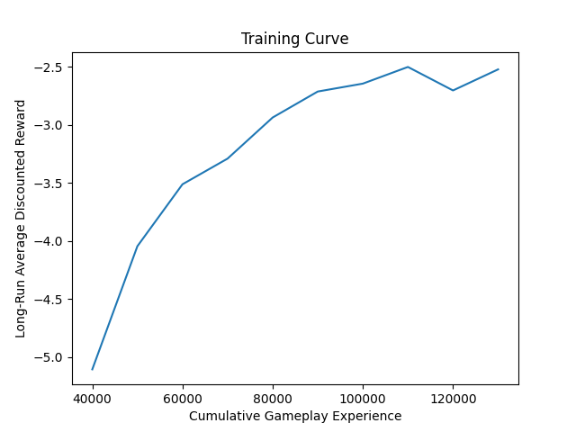
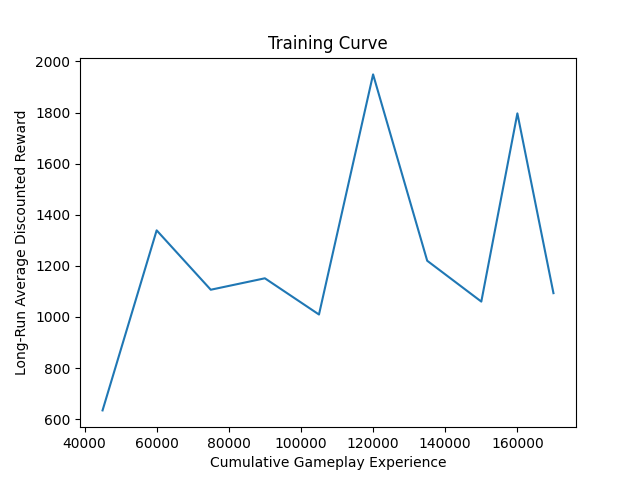
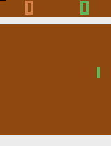
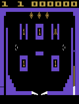

# Atari RL Agents

This repository demonstrates the development of deep reinforcement learning (DRL) agents for two classic Atari games, **PONG** and **VIDEOPINBALL**. Both agents were trained using a policy-gradient approach, with the goal of maximizing cumulative reward in the games. The agents learned by interacting with the game environment and improving their strategies through trial and error.

The models were trained using **Proximal Policy Optimization (PPO)**, a state-of-the-art reinforcement learning algorithm that balances exploration and exploitation. Through this, the agents incrementally improved their performance, ultimately reaching near-human levels of gameplay.

## Highlights

- **Games**: PONG and VIDEOPINBALL
- **Algorithm**: Proximal Policy Optimization (PPO)
- **Results**: Achieved near-optimal gameplay for both games, with training visualized through curves and best-performing gameplay GIFs.

## Contents

### Training
- **buildAndTrainAgent-PONG.py**: Script for training the PONG agent.
- **buildAndTrainAgent-VIDEOPINBALL.py**: Script for training the VIDEOPINBALL agent.

### Deployment
- **deployPONGPlayer.py**: Script for running the trained PONG agent.
- **deployVIDEOPINBALLPlayer.py**: Script for running the trained VIDEOPINBALL agent.

### Visualization and Evaluation
- **createTrainingCurvesAndVideos-PONG.py**: Generates training curves and videos showing agent performance at various stages in PONG.
- **createTrainingCurvesAndVideos-VIDEOPINBALL.py**: Generates training curves and videos showing agent performance at various stages in VIDEOPINBALL.
- **Training Curves**: Visual representations of the agents' performance over time:
  
  

  

- **Best Gameplay GIFs**:
  - PONG Best Performance:

    

  - VIDEOPINBALL Best Performance:

    

## Results

### PONG Agent
- **Training Curve**: Shows steady improvement over time, with the agent becoming progressively more skilled at keeping the ball in play and defeating the opponent.
- **Best Gameplay**: The agent demonstrates near-perfect performance after training, mastering the game mechanics.

### VIDEOPINBALL Agent
- **Training Curve**: Shows effective learning and mastery of the game mechanics, with the agent maximizing its score by effectively controlling the paddle and responding to the ball.
- **Best Gameplay**: The agent excels in controlling the paddle, maximizing its interactions with the ball, and achieving high scores.

## How to Run

1. **Install dependencies**:
   Ensure the required libraries like TensorFlow and OpenAI Gym are installed.
   ```bash
   pip install tensorflow gym
   ```

2. **Run the pre-trained agents**: 
    Use the following scripts to see the agents in action:

    - **For PONG**: 
    ```bash
    python deployPONGPlayer.py
    ```
    - **For VIDEOPINBALL**: 
    ```bash
    python deployVIDEOPINBALLPlayer.py
    ```
## CONCLUSION

The RL agents for PONG and VIDEOPINBALL demonstrate the ability of deep reinforcement learning to master complex environments. The agents were trained using PPO, an algorithm that ensures stable and efficient learning. This project highlights the potential of RL for learning and optimizing performance in continuous environments through feedback and rewards.